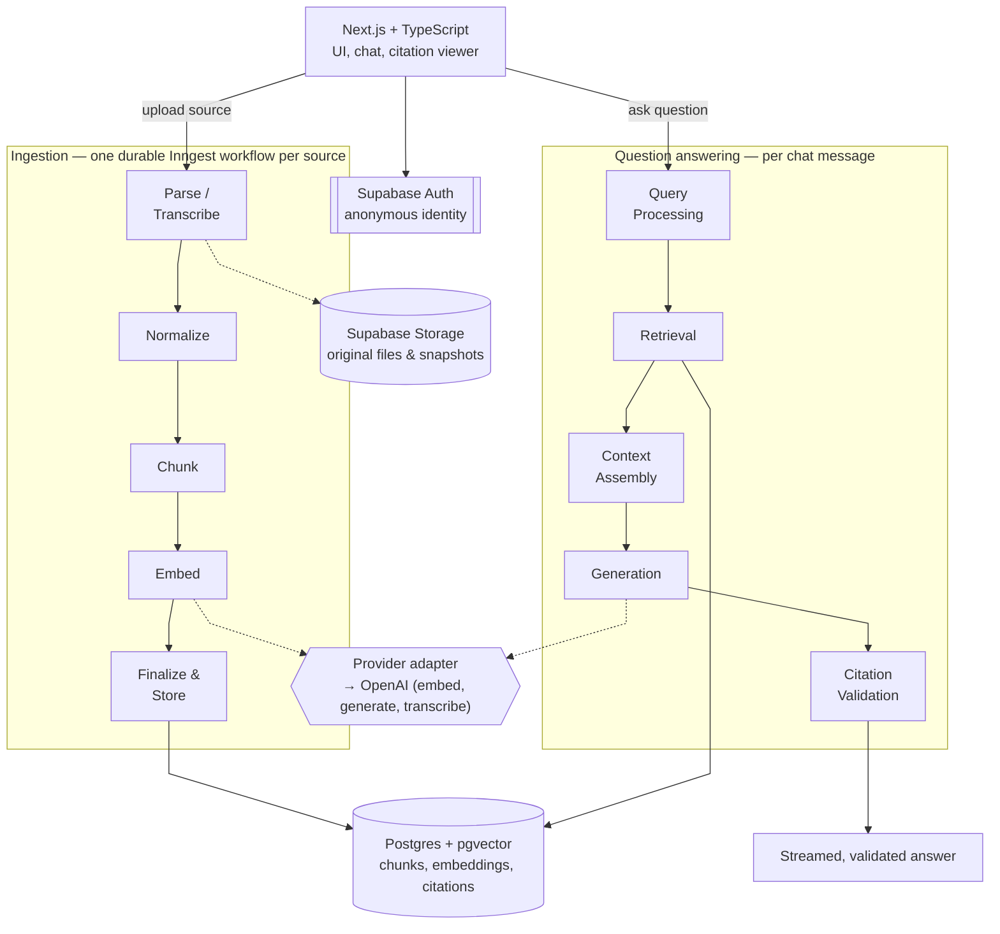

# Sourcebook

A source-grounded AI knowledge workspace, in the spirit of NotebookLM: upload sources, get an auto-generated overview, and ask questions that are answered strictly from your own material — with inspectable citations, never from the model's general knowledge.

See `docs/PRODUCT.md`, `docs/ARCHITECTURE.md`, `docs/ROADMAP.md`, and `docs/DECISIONS.md` for the full product definition, architecture, delivery plan, and design decisions. This README gives the short version.

## Architecture

The architecture is deliberately kept simple and easy to follow: two linear pipelines around one shared store, with all model calls routed through a provider adapter.

- **Ingestion** — every uploaded source runs through the same durable pipeline, one retriable workflow per source: **Parse/Transcribe → Normalize → Chunk → Embed → Store** in Postgres with pgvector.
- **Question answering** — every question runs through: **Query Processing → Retrieval → Context Assembly → Generation → Citation Validation**, so an answer is only shown once its citations are checked against the retrieved passages.
- **App shell** — Next.js + TypeScript on top of Supabase (Postgres/pgvector, Auth, Storage), with Inngest driving ingestion as a background job.
- **Provider adapter** — all embedding, generation, and transcription calls go through one adapter interface, so the application logic doesn't depend on which model or vendor sits behind it (currently OpenAI).



No model call happens directly from application code — embedding, generation, and transcription only ever go through the provider adapter, which is what keeps the pipelines above independent of the specific AI vendor.

| Layer                        | Choice                                                                             |
| ---------------------------- | ---------------------------------------------------------------------------------- |
| App / API / streaming        | Next.js (App Router) + TypeScript, deployed on Vercel                              |
| Data, vectors, auth, storage | Supabase (Postgres + pgvector, Auth, Storage)                                      |
| Background jobs              | Inngest (durable, retriable ingestion workflows)                                   |
| AI models                    | OpenAI, behind the provider adapter (`src/lib/providers/`)                         |
| Observability                | Langfuse hooks exist (`src/lib/observability/`) but are out of scope for this demo |

## Getting started

**Prerequisites:** Node.js 24+ and npm.

1. Install dependencies:
   ```bash
   npm install
   ```
2. Copy the environment template and fill in real credentials (Supabase, OpenAI, Inngest, Langfuse):
   ```bash
   cp .env.example .env.local
   ```
3. Run the dev server:
   ```bash
   npm run dev
   ```
   Open [http://localhost:3000](http://localhost:3000).

## Scripts

| Command                                   | Purpose                                 |
| ----------------------------------------- | --------------------------------------- |
| `npm run dev`                             | Start the Next.js dev server            |
| `npm run build`                           | Production build                        |
| `npm run lint`                            | Lint with ESLint                        |
| `npm run format` / `npm run format:check` | Format / check formatting with Prettier |
| `npm run typecheck`                       | Type-check with `tsc --noEmit`          |
| `npm run test`                            | Run unit/integration tests (Vitest)     |
| `npm run test:e2e`                        | Run end-to-end tests (Playwright)       |

## Project structure

- `src/app/` — Next.js App Router pages and API routes (including the Inngest handler at `src/app/api/inngest/`)
- `src/lib/notebooks/`, `src/lib/sources/` — notebook and source lifecycle (ownership, selection, deletion)
- `src/lib/ingestion/` — the parse → normalize → chunk → embed → finalize workflow and its input adapters
- `src/lib/retrieval/`, `src/lib/generation/`, `src/lib/citations/` — the query → retrieve → assemble → generate → validate pipeline
- `src/lib/providers/` — the OpenAI provider adapter (embeddings, generation, transcription)
- `src/lib/observability/` — Langfuse hook, currently a stub (not wired up for this demo)
- `src/lib/abuse-prevention/` — usage limits for the public demo
- `src/lib/supabase/` — Supabase client wiring (browser + server)
- `src/lib/inngest/` — Inngest client
- `supabase/` — Supabase CLI config and migrations (`supabase/migrations/`)
- `e2e/` — Playwright end-to-end tests

The domain module boundaries above are deliberate (`docs/ARCHITECTURE.md` §3) — new code belongs in the module matching its responsibility, not scattered across UI components.
