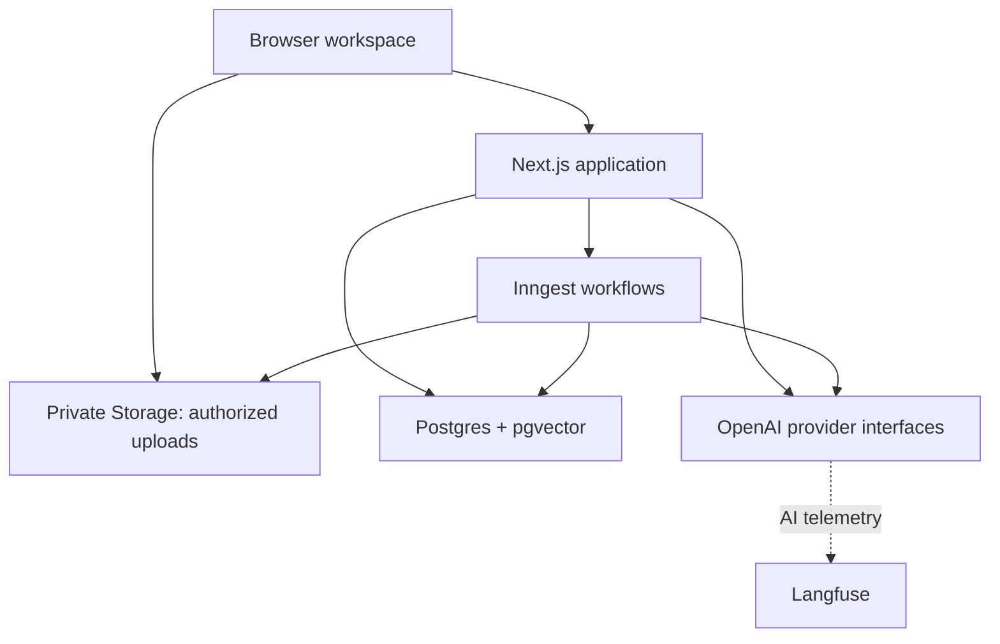

# Sourcebook — Architecture

Status: agreed design for the seven-day MVP; this document describes intended behavior, not completed implementation.

## 1. Goals and boundaries

Implement the product defined in PRODUCT.md: a persistent anonymous notebook workspace with multiple sources, one conversation per notebook, a generated overview, and strictly grounded answers with inspectable citations.

Priorities are correctness, visible failures, simple component boundaries, and a complete deployed flow. Exact models, parser libraries, and tuning values remain implementation choices. There is no separate conversation-management layer.

## 2. Stack and responsibilities

| Component | Responsibility |
| --- | --- |
| Next.js + TypeScript on Vercel | UI, authenticated application endpoints, streaming chat, and Inngest function handlers |
| Supabase Auth | Persistent browser-based anonymous identity |
| Supabase PostgreSQL | Authoritative application data, job progress, revisions, messages, and citations |
| pgvector | Source-filtered semantic retrieval |
| Private Supabase Storage | Original files and extracted document snapshots |
| Inngest | Durable background orchestration, granular steps, and retries |
| OpenAI | Embeddings, query rewriting, answers, source summaries, and notebook synthesis |
| Langfuse | AI traces, timing, token usage, and evaluation visibility — **cut from this submission**, see §12 |

Supabase owns application state; Inngest executes work; Langfuse would observe it once implemented. Neither job history nor traces substitute for application records.

## 3. Application and provider boundaries

Separate notebook/source operations, ingestion, retrieval, answer generation, and citation resolution into small server-side modules. UI components consume application state rather than implementing retrieval or permission rules.

Use small generation and embedding interfaces, initially implemented only for OpenAI. Configure model names independently for answers, query rewriting, source summaries, and notebook overviews. Keep prompt versions and generation parameters explicit.

Embedding configuration includes model and vector dimensions. Document and query embeddings must use the same compatible configuration; changing it requires re-embedding and potentially a database migration, not merely changing an environment variable.

## 4. Logical data model

The following describes responsibilities rather than prescribing every column or physical table.

| Entity | Key data and purpose |
| --- | --- |
| Anonymous user | Supabase Auth identity; ownership root |
| Notebook | Owner, editable title, timestamps, source revision, overview state and published revision, chat answer style/custom style and answer length settings |
| Source | Notebook, type, title/origin, private object paths, batch ID, content version/hash, processing state, current step, failure details, deletion marker |
| Processing step | Source/version, step name, status, attempts, timestamps, checkpoint references, safe error details |
| Source chunk | Source/version, stable ID, ordered text, page/section metadata, optional offsets, embedding and embedding configuration |
| Source summary | Source/content version, grounded summary, supporting chunk references, model/prompt version, status |
| Notebook overview | Synthesis, topics with suggested questions, source revision, generation metadata; may be stored on the notebook |
| Message / generation attempt | Notebook, role, content, status, selected source IDs at submission, attempt ID, timestamps, error and model metadata |
| Message citation | Message, source/chunk identity, display metadata, passage locator, availability status |

Keep source and processing identities stable across retries. A notebook owns messages directly. Citation metadata can survive source deletion without retaining the deleted source passage.

## 5. Identity and isolation

- Supabase anonymous authentication persists across refreshes and return visits in the same browser. Clearing the session loses access; account recovery and cross-device access are outside the MVP.
- Row-level security isolates notebooks and all dependent records by ownership. Storage is private and enforces the same ownership boundary.
- Application endpoints authenticate requests and validate notebook/source ownership. Client-provided IDs are never proof of access.
- Background handlers verify event authenticity, current ownership, source existence, and version before using privileged database access. Privileged credentials remain server-side.
- Original files are accessible through short-lived authorized links. Citation and passage endpoints also check current ownership and deletion state.

## 6. Source ingestion

### Input paths and adapters

Authorize an upload destination, upload directly to private Storage, then register the completed upload and enqueue processing. Validate the stored object and limits server-side. URL and pasted-text submissions enter the same pipeline after registration.

An expandable adapter interface produces a common document structure: title, origin, and ordered text blocks with page/section metadata. Initial inputs are PDF, DOCX, TXT/Markdown, copied text, audio, and a public website URL.

- PDF extraction preserves page boundaries.
- DOCX preserves headings where available; it does not invent PDF-like page numbers.
- Text inputs preserve useful section and paragraph structure.
- Audio is transcribed via Whisper into timed text blocks.
- Websites extract human-readable text from one public HTML page and retain title and URL. Store a snapshot so later page changes do not alter existing citations. A YouTube URL relies on its caption track (manual or auto-generated); a video with no caption track fails with a clear error rather than falling back to audio extraction — unofficial YouTube stream-extraction libraries are unreliable enough (dead or actively broken by YouTube's own anti-scraping changes) that we don't depend on one in the ingestion path. A caption-less video's audio can still be added by downloading it separately and uploading it as a direct Audio source.

Parser libraries remain to be selected. Unsupported, encrypted, and image-only documents fail with an actionable explanation; OCR is excluded.

### Granular workflow

One independently retriable workflow runs per source, with observable steps:

1. **Parse:** read the original input through its adapter.
2. **Normalize:** produce clean text blocks while retaining provenance.
3. **Chunk:** split at paragraph/section boundaries toward a configurable target size with modest overlap. Do not cross PDF page boundaries.
4. **Embed:** embed and persist chunks in bounded batches.
5. **Finalize:** verify completeness and publish the source as ready.

Persist checkpoints or references to intermediate outputs so retries can resume where possible. Large document payloads stay in storage/database records, not event bodies. Source/version/step keys and uniqueness constraints make repeated execution idempotent.

Chunks may exist during processing but are excluded from retrieval until finalization succeeds. Failures record the step and a safe explanation; successfully processed sources remain usable. The UI polls while processing is active and surfaces progress and retry actions.

Source states include uploaded, processing, ready, and failed, with separate deletion/version guards. A completed upload whose enqueue operation fails remains visibly pending/failed and can be retried without duplicating the source.

## 7. Notebook overview

The first time a notebook's sources all reach a terminal ingestion state (ready or failed), with at least one ready, a one-shot workflow samples early chunks from each ready source and generates a short title, a synthesis, and initial follow-up questions as the notebook's opening message. This runs exactly once per notebook, claimed via a generation guard on the notebook row so concurrent finalize steps cannot double-generate it.

Later source additions or deletions do not regenerate the overview, and checkbox (selection) changes never do — the overview reflects only the sources present at first generation. If the first attempt fails (no usable sample text, provider error), the notebook simply has no overview; nothing partial or stale is published, and there is no retry path.

Regeneration, per-source summary caching, and revision/staleness tracking are explicitly out of scope for this one-shot design; see ADR-007 for the trade-off.

## 8. Retrieval and grounded chat

1. Authenticate the request, enforce usage limits, and acquire the notebook's single-generation guard.
2. Persist the question, attempt identity, and selected ready source IDs. Reject an empty selection with an actionable message.
3. Use bounded recent conversation context to rewrite a dependent follow-up into a standalone retrieval query. Previous answers help interpret the question but are not evidence.
4. Embed the query with the configured embedding model.
5. Search vectors within the owned notebook, selected source IDs, ready state, and current source versions. Apply filters during retrieval, not after an unrestricted search.
6. Assemble a configurable Top-K result set within a maximum context budget, with stable passage IDs and provenance.
7. Generate from those passages only, returning either a supported answer with passage references or an explicit insufficient-evidence response. The system prompt also carries the notebook's saved chat style (default, or a custom role/tone instruction) and answer length (shorter/default/longer), read fresh at generation time — changing these settings affects future questions only, the same as changing source selection, and does not apply to notebook overview generation.
8. Validate the completed structure and citation references, then persist the completed answer and citation mappings.

Similarity scores guide retrieval; they are not proof of answerability. An empty result set produces an explicit limitation. Unsupported questions are refused without supplementation from general model knowledge. Source content is treated as evidence, not as instructions to change system behavior.

Changing source selection affects future questions only. Recent messages never authorize retrieval from deselected sources.

### Streaming and persistence

Stream provisional answer text to the UI. Only references already validated against the supplied passage set become clickable. On completion, validate the full response before marking it complete and saving its final citation mappings.

Interrupted or invalid responses are visibly incomplete and retryable. Attempts have unique IDs so retries and late results cannot create duplicate completed answers. One generation is allowed per notebook, enforced on the server with a recoverable guard/lease; timeout recovery prevents a permanently locked notebook.

The concrete streaming schema/parser remains an implementation choice. Structural validation can prevent invented citation targets, but it cannot prove semantic support for every claim.

## 9. Citations and source viewer

The model references supplied passage IDs. The server resolves labels and locations from trusted metadata rather than accepting model-generated source names or page numbers.

| Input | Displayed reference |
| --- | --- |
| PDF | Source name and page number |
| DOCX, TXT/Markdown, copied text | Source name and section or passage |
| Website | Page title and URL |

Every available citation opens the same side panel showing the stored supporting passage and its locator. The supporting passage may be a retrieved chunk; finer offsets can be added where reliable. Original PDF rendering and in-file highlighting are excluded. An authorized temporary link can open the original uploaded file.

Deselecting preserves citation access. Deleting preserves prior answers and reference labels but marks affected citations unavailable; the viewer must not serve deleted content.

## 10. Concurrency, revisions, and deletion

- Maintain a notebook source revision covering changes to the usable source set. Overview work captures the revision and publishes only through an atomic revision check.
- Coalesce overlapping overview requests where practical. If a revision changes during generation, discard the stale publication and schedule work for the current ready set once processing settles.
- Ingestion writes are guarded by source content version and deletion state. Deleted sources cannot be resurrected by late jobs.
- On confirmed source deletion, immediately exclude it from retrieval and passage access, invalidate its overview contribution, then remove its content, embeddings, summaries, and storage objects through retryable cleanup. Retain only minimal metadata needed for unavailable historical references.
- Check source availability before final answer publication. If a supporting source was deleted during generation, do not finalize the answer as though that evidence remained available; mark the attempt incomplete and offer retry.

Database checks, rather than cancellation alone, provide correctness when background jobs overlap.

## 11. Website and public-demo safeguards

Fetch only a supplied public HTTP(S) HTML page. Enforce request timeouts, redirect limits, response-size limits, and extracted-text limits. Block private/internal destinations and validate resolved destinations again for redirects. Login-dependent pages and pages requiring JavaScript rendering receive an unsupported-source error. There is no crawler or web-search service.

Enforce 10 sources per notebook and 50 MB per uploaded file (25 MB for audio, matching the transcription provider's own limit) server-side. Configure additional limits for pasted/extracted text, questions per anonymous user, context size, and simultaneous jobs. Use a deployment-wide usage ceiling because anonymous identities can be recreated. Reject or defer new AI work visibly when limits are reached.

Keep API credentials and privileged database keys out of the browser and repository. Numeric quotas, budget accounting details, and retention/cleanup timing are implementation settings to document before deployment.

## 12. Observability and failure handling

**Langfuse is cut from this submission.** `src/lib/observability/` exists as an empty stub module so the boundary from ADR-010 is preserved, but no tracing calls are wired into ingestion or generation. The design below (model/prompt versions, timings, token usage, retrieved source/chunk IDs, outcome, sanitized errors by default, full-content tracing only under an explicit dev setting) remains the intended future implementation, not current behavior. Apply this policy to automatic instrumentation as well as application logs once it is built.

Correlate traces with notebook, source, job, and generation-attempt IDs. Trace failures must not fail user work. Supabase remains authoritative for user-visible status.

| Failure | Expected behavior |
| --- | --- |
| Upload or registration failure | Clear error; retry without duplicate registration |
| Parsing or embedding failure | Failed step visible; bounded retries and manual retry where recoverable |
| Summary or overview failure | Chat remains usable; previous overview retained with update failure |
| No supporting evidence | Explicit refusal, not a fabricated answer |
| Provider or stream failure | Incomplete attempt with retry; existing history remains intact |
| Invalid citation or output structure | Do not mark response complete |
| Stale or duplicate job | Guarded no-op or safe retry; no stale publication |
| Limit exceeded | Actionable limit message before accepting further costly work |

## 13. Verification and deployment

- **Unit:** adapter outputs, chunk boundaries/provenance, input validation, and citation mapping/validation.
- **Integration:** ownership isolation including vector and storage access, ingestion checkpoints/retries, duplicate events, stale overview protection, deletion races, and generation guards.
- **End-to-end:** create notebook → upload → ready → question → grounded answer → inspect citation.
- **Fixed AI evaluation set:** supported questions, insufficient evidence, follow-ups, and changed source selection. Assess semantic support as well as citation validity.

Deploy the Next.js application and Inngest handlers on Vercel, with managed Supabase, Inngest, and OpenAI integrations (Langfuse is cut from this submission per §12). Keep database schema and RLS changes in versioned migrations; document environment variables and local setup. Choose parser runtimes and step sizes within the actual hosting execution limits before implementation is finalized.

## 14. Deliberate trade-offs and remaining choices

The MVP uses vector Top-K retrieval, polling, extracted-text citation viewing, one generation per notebook, and persistent anonymous sessions. Agentic retrieval, hybrid search, reranking, OCR, browser-based website rendering, realtime subscriptions, account recovery, and collaboration are excluded.

Before implementation, select exact parser libraries, model identifiers, embedding dimensions, chunk sizes/overlap, Top-K/context budgets, timeout/retry settings, streaming schema, and numeric quotas. These are tuning or library choices within the agreed design, not additional product features.

One documentation alignment item: the interview included Markdown alongside TXT, while the existing PRODUCT.md source table lists only TXT. This architecture retains the agreed TXT/Markdown adapter scope; the product file has not been modified here.
